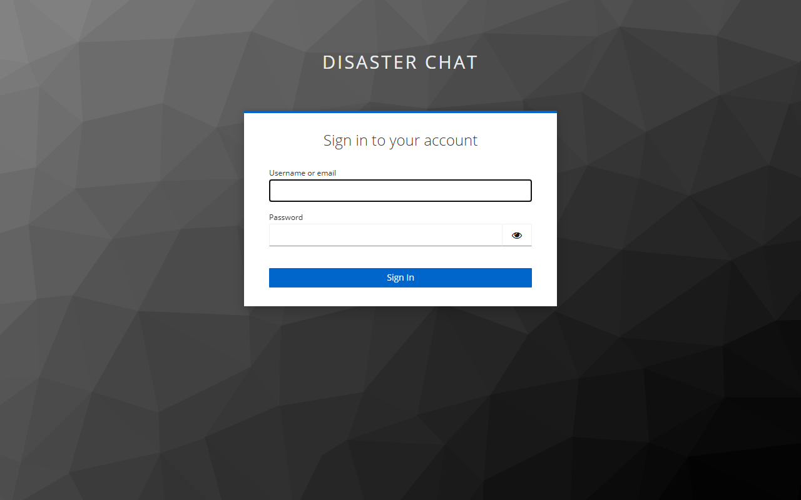
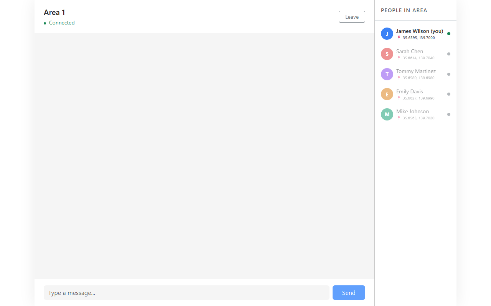
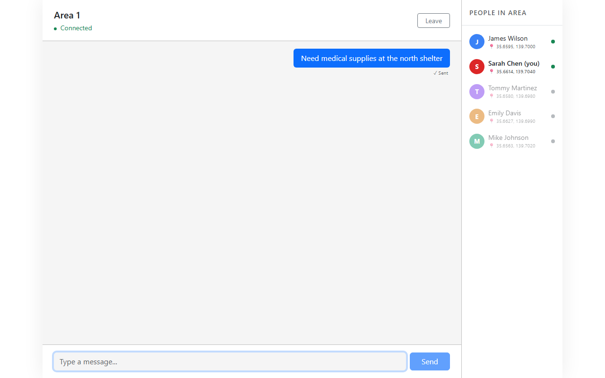
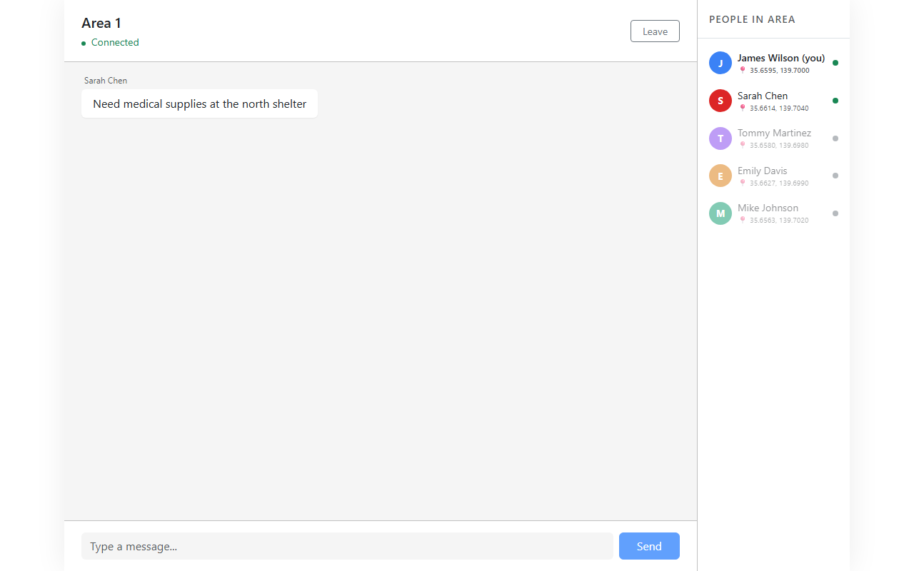

# Disaster Response Chat

Quick demo for disaster response group chat.

## Try it on-the-fly


https://obscure-space-zebra-676q45wv99w34644-80.app.github.dev/


## Features

### Keycloak-based basic login
Keycloak SSO login, redirects back to the chat after auth.



### Group Chat
Area-based chat room with a member list and online/offline indicators.



### Real-time Messaging
Messages show up instantly over websockets. Sent messages appear on the right. 



Incoming messages appear on the left.



## Setup

```
docker compose up --build
```

frontend: http://localhost  
keycloak admin: http://localhost/admin/ (admin/admin)

Available users (password is `password`):
- james.wilson@email.com
- sarah.chen@email.com
- tom.martinez@email.com
- emily.davis@email.com
- mike.johnson@email.com

## Tests

```
cd backend && python -m pytest
cd frontend && npx vitest run
```

## Some issues

- Websockets are in-memory, connections drop on restart
- No pagination yet
- Keycloak token refresh doesn't work, just re-login
- Locations are hardcoded from the seed
- No messaging queue (e.g. Kafka) r cache services (e.g. Redis) yet. Needs more QPS to consider messaging queue (around 500 QPS)
